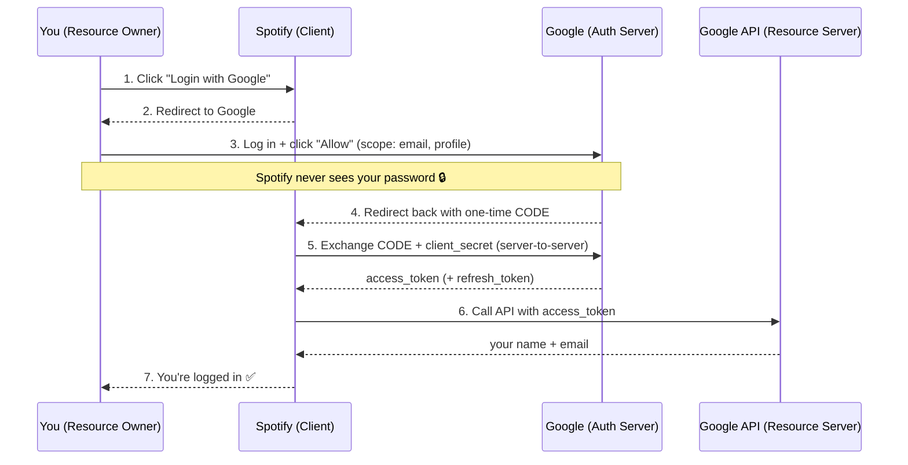
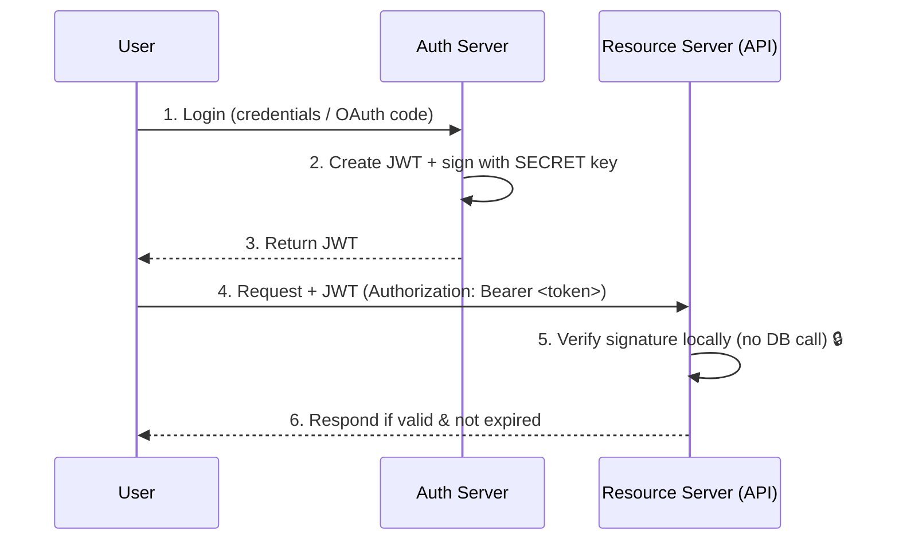

# OAuth 2.0

## What is it?

**OAuth 2.0** lets a third-party app access some of your data on another service **without ever seeing your password**.

> Example: **Spotify** wants your name and email from **Google**. Instead of you giving Spotify your Google password, Google hands Spotify a **token** that grants limited access. Spotify never learns your password.

**One-liner:** OAuth 2.0 = **delegated, limited access** using a **token** instead of a password.

---

## The 4 Roles

| Role | In our example |
|------|----------------|
| **Resource Owner** | You (the user) |
| **Client** | Spotify (the third-party app) |
| **Authorization Server** | Google (verifies you, issues token) |
| **Resource Server** | Google API (holds your data) |

---

## The Flow: "Login with Google"



**In words:**
1. You click **"Login with Google"** on Spotify.
2. Spotify redirects you to Google.
3. You log in on Google's page and approve (Spotify never sees your password).
4. Google sends Spotify a short-lived **authorization code**.
5. Spotify's server exchanges that code (plus its secret) for an **access token**.
6. Spotify uses the token to fetch your name and email from Google.
7. You're logged in.

---

## Key Terms

| Term | Meaning |
|------|---------|
| **Scope** | What the app is allowed to access (e.g. `email`, `profile`) |
| **Authorization Code** | One-time, short-lived code, swapped for a token |
| **Access Token** | Short-lived key used to call the API |
| **Refresh Token** | Long-lived key to get a new access token without re-login |

---

## Interview Quick Notes

- **OAuth = authorization** (access), **not** authentication (identity).
- **"Login with Google"** = OAuth 2.0 + **OpenID Connect** on top for identity.
- The app **never sees your password** — that's the whole point.
- **Code → token swap happens server-to-server**, so the token isn't exposed in the browser.
- **Access token** = short-lived; **Refresh token** = renews it silently.

---

# JWT (JSON Web Token)

## What is it?

A **JWT** is a **self-contained, digitally signed token** that carries user data (claims) inside it. Because it's signed, anyone with the key can verify it **hasn't been tampered with** — no database lookup needed.

> In OAuth 2.0, the Authorization Server usually issues the **access token as a JWT**, so the Resource Server can validate it **locally** instead of calling back on every request.

**One-liner:** JWT = a **tamper-proof JSON token** you can **verify without a database**.

---

## Structure: 3 Parts

A JWT is 3 Base64URL parts joined by dots: `header.payload.signature`

| Part | Contains | Example |
|------|----------|---------|
| **Header** | Algorithm + type | `{ "alg": "HS256", "typ": "JWT" }` |
| **Payload** | Claims (data) | `{ "sub": "123", "email": "a@b.com", "exp": 1699999999 }` |
| **Signature** | Signed hash of header+payload | verifies integrity |

```
eyJhbGciOi...   .   eyJzdWIiOiI...   .   SflKxwRJSM...
   HEADER               PAYLOAD              SIGNATURE
```

---

## The Flow: Issue & Verify



**In words:**
1. User logs in (or completes the OAuth code exchange).
2. Auth Server builds the JWT and **signs** it with its secret/private key.
3. The signed JWT is handed to the client.
4. Client sends it on every request in the `Authorization: Bearer <token>` header.
5. The API **verifies the signature locally** — no database or callback needed.
6. If the signature is valid and the token hasn't expired, access is granted.

---

## Key Terms

| Term | Meaning |
|------|---------|
| **Claims** | Key–value data inside the payload (e.g. `sub`, `email`, `exp`) |
| **Signature** | Proves the token wasn't altered and came from the issuer |
| **HS256 / RS256** | Symmetric (shared secret) / Asymmetric (private–public key) signing |
| **`exp`** | Expiry timestamp — token is rejected after it |
| **Bearer Token** | Whoever holds the token can use it — so keep it safe |

---

## Interview Quick Notes

- **JWT = format**, **OAuth = framework** — OAuth *often* uses JWT as the token format.
- **Stateless**: the server verifies via signature, so **no session storage** is needed.
- **Payload is only Base64, not encrypted** — never put secrets in it; anyone can read it.
- **RS256** lets the API verify with a **public key** while only the Auth Server holds the private key.
- **Keep tokens short-lived** — you can't easily revoke a JWT before it expires.
