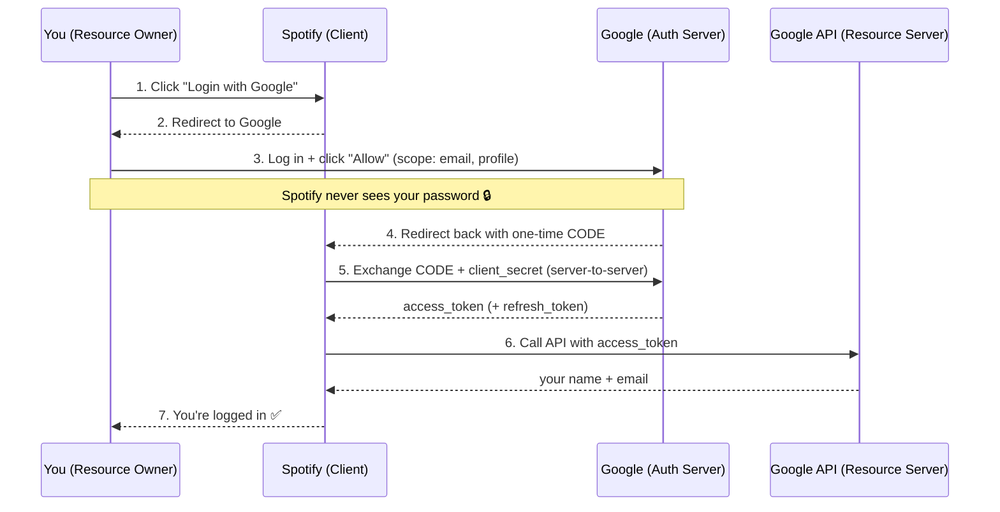

# OAuth 2.0

## What is it?

**OAuth 2.0** lets a third-party app access some of your data on another service **without ever seeing your password**.

> Example: **Spotify** wants your name and email from **Google**. Instead of you giving Spotify your Google password, Google hands Spotify a **token** that grants limited access. Spotify never learns your password.

**One-liner:** OAuth 2.0 = **delegated, limited access** using a **token** instead of a password.

---

## The 4 Roles

| Role | In our example |
|------|----------------|
| **Resource Owner** | You (the user) |
| **Client** | Spotify (the third-party app) |
| **Authorization Server** | Google (verifies you, issues token) |
| **Resource Server** | Google API (holds your data) |

---

## The Flow: "Login with Google"

**In words:**
1. You click **"Login with Google"** on Spotify.
2. Spotify redirects you to Google.
3. You log in on Google's page and approve (Spotify never sees your password).
4. Google sends Spotify a short-lived **authorization code**.
5. Spotify's server exchanges that code (plus its secret) for an **access token**.
6. Spotify uses the token to fetch your name and email from Google.
7. You're logged in.

---

## Key Terms

| Term | Meaning |
|------|---------|
| **Scope** | What the app is allowed to access (e.g. `email`, `profile`) |
| **Authorization Code** | One-time, short-lived code, swapped for a token |
| **Access Token** | Short-lived key used to call the API |
| **Refresh Token** | Long-lived key to get a new access token without re-login |

---

## Interview Quick Notes

- **OAuth = authorization** (access), **not** authentication (identity).
- **"Login with Google"** = OAuth 2.0 + **OpenID Connect** on top for identity.
- The app **never sees your password** — that's the whole point.
- **Code → token swap happens server-to-server**, so the token isn't exposed in the browser.
- **Access token** = short-lived; **Refresh token** = renews it silently.
