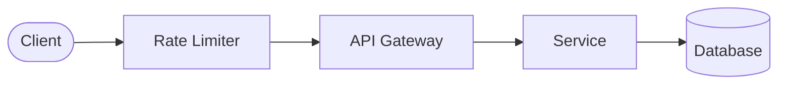
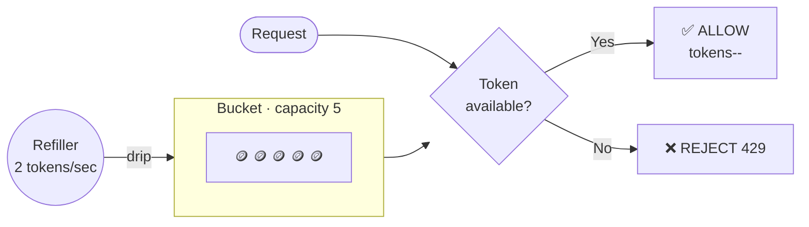
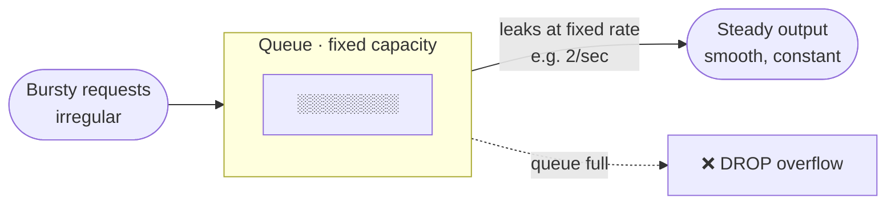
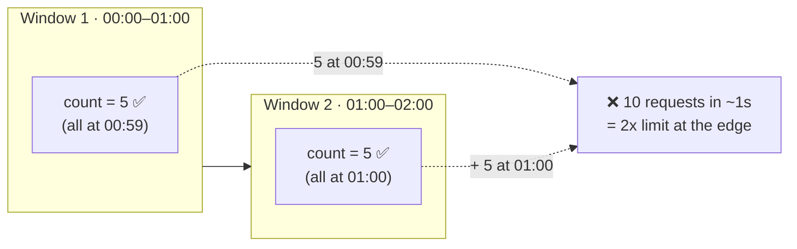
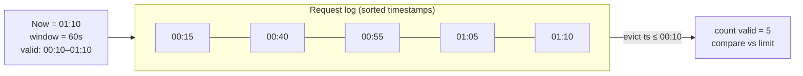
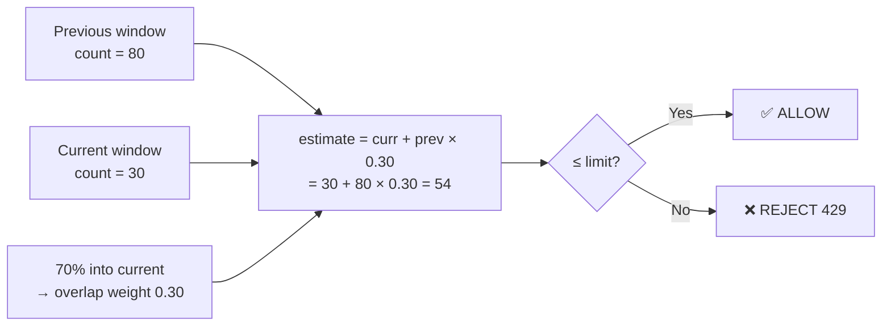
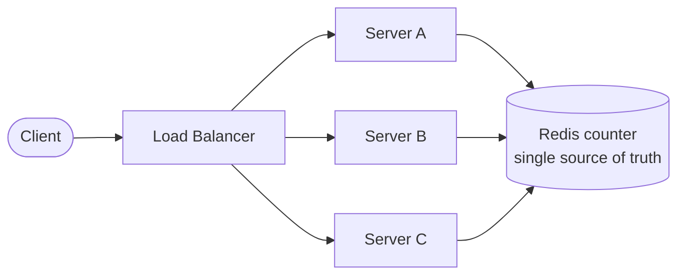
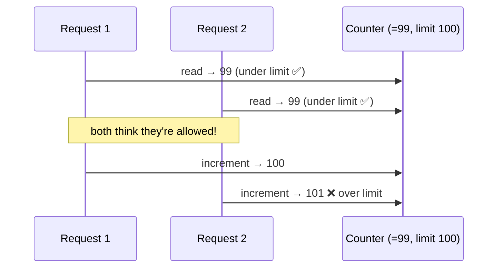
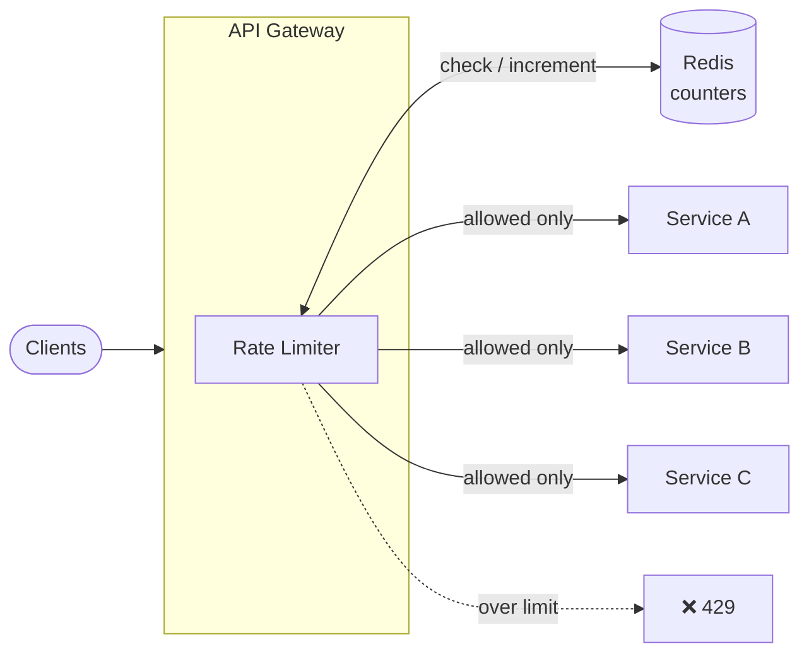

# Rate Limiter

## What is a Rate Limiter?

A rate limiter controls **how many requests a client can make to a service within a given time window**. When the limit is exceeded, further requests are rejected (usually with HTTP `429 Too Many Requests`) or throttled/queued.

It acts as a **gatekeeper** in front of your service, protecting it from being overwhelmed by too much traffic — whether malicious (DDoS, brute-force) or accidental (buggy client in a retry loop).

---

## Why Do We Need Rate Limiting?

| Problem | How Rate Limiting Solves It |
|---------|-----------------------------|
| DDoS / abuse | Caps requests per client, blocking floods |
| Resource exhaustion | Prevents any one user from hogging CPU/DB/bandwidth |
| Cost control | Limits expensive downstream calls (3rd-party APIs, LLM tokens) |
| Fair usage | Ensures no single tenant starves others (noisy neighbor) |
| Brute-force attacks | Throttles repeated login/OTP attempts |
| Cascading failures | Sheds load before the system tips over |

---

## Key Terms

| Term | Meaning |
|------|---------|
| **Limit** | Max allowed requests (e.g., 100) |
| **Window** | Time period the limit applies to (e.g., per minute) |
| **Throttling** | Slowing/delaying requests instead of rejecting |
| **Burst** | A short spike of requests above the steady rate |
| **Quota** | A longer-term limit (e.g., 10,000/day) |
| **Backoff** | Client waiting (often exponentially) before retrying |

---

## Where Can a Rate Limiter Be Placed?



1. **Client-side** — polite self-throttling; cannot be trusted (client can bypass)
2. **API Gateway / Load Balancer** — most common; centralized, before traffic hits services
3. **Middleware in the service** — fine-grained, per-endpoint control
4. **Dedicated rate-limiter service** — shared across many microservices

> **Interview tip:** Placing it at the **API Gateway** is the standard answer — it stops bad traffic early and keeps the logic out of every microservice.

---

## Rate Limiting Algorithms

### 1. Token Bucket
- A bucket holds up to **N tokens**; tokens refill at a fixed rate (e.g., 10/sec).
- Each request consumes 1 token. No token → request rejected.
- **Allows bursts** up to bucket capacity, then settles to the refill rate.



- **Pros**: Smooth handling of bursts, memory-efficient (2 values: tokens + timestamp)
- **Cons**: Tuning capacity vs refill rate needs thought
- **Best for**: Most APIs — the industry default (AWS, Stripe use variants)

### 2. Leaky Bucket
- Requests enter a **queue (bucket)**; processed at a **constant leak rate**.
- Overflow (full queue) → requests dropped.
- **Smooths out bursts** into a steady stream.



- **Pros**: Very smooth, constant outflow rate
- **Cons**: Bursts add latency (queued); can drop requests when full
- **Best for**: Traffic shaping where a steady downstream rate is required

> **Is the "bucket" a queue?** Only for **Leaky Bucket** — it's literally a **FIFO queue** holding *requests* that wait and leak out at a fixed rate. **Token Bucket** is **not** a queue: the bucket holds *tokens* (permits) and is just a **counter** (2 values: `tokens` + `last_refill_timestamp`). Requests aren't stored — they grab a token and proceed instantly, or get rejected. That's why Token Bucket is O(1) memory while Leaky Bucket is O(queue).

### 3. Fixed Window Counter
- Count requests per fixed window (e.g., 00:00–00:01). Reset counter each window.
- **Simple**, but has a **boundary problem**: a client can send `2x` the limit around the window edge.



- **Pros**: Easiest to implement, low memory
- **Cons**: Burst at window boundaries (up to 2x limit)
- **Best for**: Rough limits where precision isn't critical

### 4. Sliding Window Log
- Store a **timestamp for every request** in a log (sorted set).
- Count entries within the last window; evict older ones.
- **Perfectly accurate**, no boundary problem.



- **Pros**: Exact, no edge bursts
- **Cons**: High memory — stores every request timestamp
- **Best for**: Low-volume, high-precision limits

### 5. Sliding Window Counter
- Hybrid of fixed window + weighting. Approximates the sliding window using the current and previous window counts.
- `count = curr_window_count + prev_window_count * (overlap %)`



- **Pros**: Smooth like sliding log, but ~O(1) memory like fixed window
- **Cons**: Approximate (small error), but good enough in practice
- **Best for**: The **best real-world balance** — used by Cloudflare, etc.

### Algorithm Comparison

| Algorithm | Bursts | Accuracy | Memory | Complexity |
|-----------|--------|----------|--------|------------|
| Token Bucket | Allowed (up to cap) | Good | O(1) | Low |
| Leaky Bucket | Smoothed | Good | O(queue) | Low |
| Fixed Window | Boundary spikes | Poor at edges | O(1) | Very low |
| Sliding Window Log | None | Exact | O(N requests) | Medium |
| Sliding Window Counter | Minimal | Very good | O(1) | Medium |

> **Interview default:** Start with **Token Bucket** (bursts + simplicity). Mention **Sliding Window Counter** as the memory-efficient accurate option.

---

## What Do We Rate Limit By? (Identifying the Client)

| Key | Use Case | Caveat |
|-----|----------|--------|
| **IP address** | Anonymous traffic, DDoS | NAT/shared IPs punish many users; IPv6 easy to rotate |
| **User ID / API key** | Authenticated APIs | Requires auth before limiting |
| **API key + endpoint** | Per-route tiers | More granular quota control |
| **Geography / region** | Regional policies | — |
| **Combination** | e.g., user + endpoint + method | Most precise, more state |

---

## Distributed Rate Limiting

A single-server counter breaks when you have **many instances** behind a load balancer — each would only see part of the traffic. The limit must be **shared/global**.



> Without a shared store, each node keeps its own local count and **undercounts** the global total — the client can exceed the limit N-fold across N servers.

### Approaches

1. **Centralized store (Redis / Memcached)**
   - All instances read/write the same counter.
   - Redis is the standard — fast, atomic ops (`INCR`, `EXPIRE`), Lua scripts for atomicity.
   - **Trade-off**: Adds a network hop + Redis becomes a critical dependency.

2. **Sticky sessions** — Route a client always to the same server so local counters work. Fragile; creates hotspots (same problem as LB sticky sessions).

3. **Local + sync (approximate)** — Each node keeps a local counter and periodically syncs/gossips. Fast but eventually consistent → can slightly overshoot the limit.

> **Atomicity is non-negotiable** — the check-and-increment must be atomic (Redis `INCR`/Lua), or concurrent requests race, as shown below.

### The Race Condition Problem



> **Fix:** atomic `INCR` (server-side) or a Lua script / distributed lock so read-and-increment is one indivisible step.

---

## Redis-Based Token Bucket (Sketch)

```
KEY = rate_limit:{user_id}
Stored: { tokens, last_refill_timestamp }

On request (atomic Lua):
  now        = current_time
  elapsed    = now - last_refill
  tokens     = min(capacity, tokens + elapsed * refill_rate)
  if tokens >= 1:
      tokens -= 1
      last_refill = now
      return ALLOW
  else:
      return REJECT (429)
```

The whole block runs as **one atomic Lua script** so concurrent requests can't double-spend tokens.

---

## What to Return When Limited

- **Status code**: `429 Too Many Requests`
- **Response headers** (help well-behaved clients back off):

| Header | Meaning |
|--------|---------|
| `RateLimit-Limit` | Max requests in the window |
| `RateLimit-Remaining` | Requests left |
| `RateLimit-Reset` | Seconds until the window resets |
| `Retry-After` | How long to wait before retrying |

> Returning `Retry-After` lets clients implement **exponential backoff** instead of hammering.

---

## Handling the Rate Limiter Failure (Fail Open vs Fail Closed)

If Redis/the limiter is **down**, what do you do?

| Strategy | Behavior | Use When |
|----------|----------|----------|
| **Fail Open** | Allow all traffic through | Availability > protection (most user-facing APIs) |
| **Fail Closed** | Reject all traffic | Security-critical (payments, auth) |

> **Interview tip:** Say **"fail open with alerts"** for most services — you don't want your rate limiter to become the cause of an outage. Add local fallback counters as a safety net.

---

## Common Interview Questions

### Q1: How would you design a rate limiter for an API serving millions of users?
**Key points:**
- Place it at the API Gateway
- Use Token Bucket or Sliding Window Counter
- Store counters in Redis for a global/distributed limit
- Use atomic ops (Lua/INCR) to avoid race conditions
- Return `429` + `Retry-After` headers
- Decide fail-open vs fail-closed

### Q2: Token Bucket vs Leaky Bucket — difference?
- **Token Bucket**: allows bursts (up to capacity), then steady rate. Bucket holds *tokens*.
- **Leaky Bucket**: enforces a *constant* output rate, smoothing bursts. Bucket holds *requests* in a queue.

### Q3: What's the problem with Fixed Window Counter?
- Boundary spike — a client can send up to **2x** the limit across the window edge (limit at end of one window + limit at start of next).
- Fix with Sliding Window Log (exact) or Sliding Window Counter (approx, cheap).

### Q4: How do you rate limit across multiple servers?
- Centralized counter in Redis (single source of truth) with atomic increments.
- Alternatives: sticky sessions (fragile) or local counters with gossip sync (approximate).

### Q5: How do you avoid race conditions in a distributed limiter?
- Atomic operations: Redis `INCR`+`EXPIRE`, or a **Lua script** running the read-modify-write as one unit. Optionally distributed locks (slower).

### Q6: What do you rate limit by?
- IP (anonymous), user ID / API key (authenticated), or a combination (user + endpoint). Mention NAT/shared-IP caveats.

### Q7: Rate limiter is down — allow or block traffic?
- **Fail open** for availability-first services (with alerting); **fail closed** for security-critical paths.

---

## Real-World Architecture Example



---

## Key Takeaways for Interviews

1. **Start with Token Bucket** — burst-friendly and simple; the safe default answer.
2. **Know all 5 algorithms** and their trade-offs (burst handling, accuracy, memory).
3. **Fixed Window has a boundary bug** — mention Sliding Window Counter as the fix.
4. **Distributed = shared Redis counter** with atomic ops to avoid races.
5. **Race conditions** — solve with `INCR`/Lua, not read-then-write.
6. **Identify the client** — IP vs user/API key, and the NAT caveat.
7. **Return `429` + `Retry-After`** so clients back off gracefully.
8. **Fail open vs fail closed** — pick based on availability vs security.
9. **Place at the API Gateway** — stop bad traffic before it reaches services.

---

## Tools & Technologies to Reference

| Tool | Type | Notes |
|------|------|-------|
| Redis | Store | Atomic counters, `INCR`/`EXPIRE`, Lua scripts — the standard backend |
| NGINX | Gateway | `limit_req` (leaky bucket), `limit_conn` |
| Envoy | Proxy | Global rate limiting via external rate-limit service (gRPC) |
| Kong | API Gateway | Rate-limiting plugins (local/cluster/Redis) |
| AWS API Gateway | Cloud | Built-in throttling (token bucket: rate + burst) |
| Cloudflare | Edge/WAF | Sliding-window rate limiting at the edge |
| Stripe | API | Token-bucket-style limits, documented headers |

---

*Last Updated: 2026-08-09*
