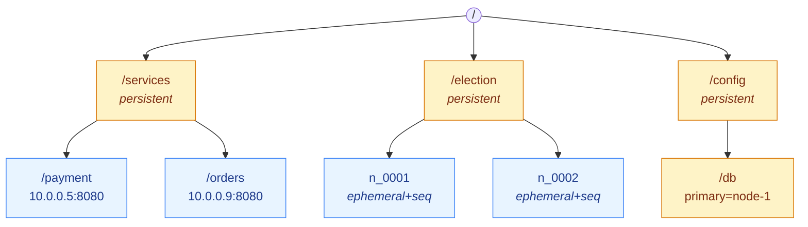
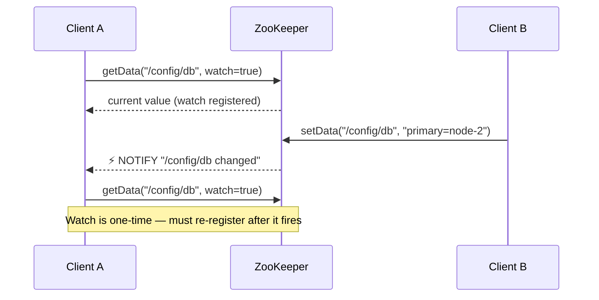
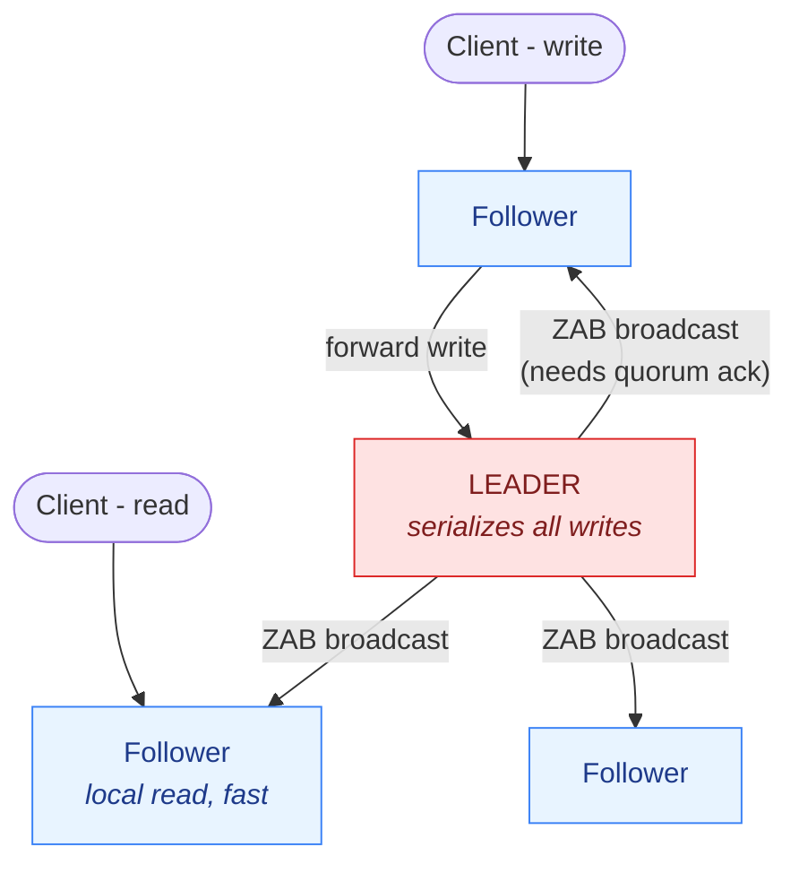
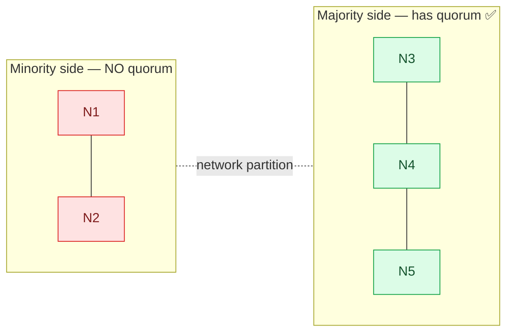
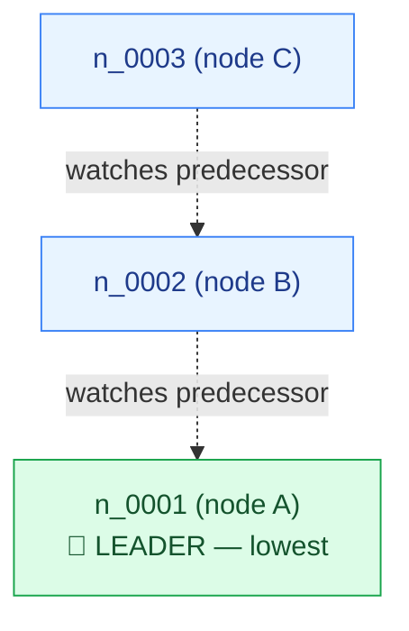

# ZooKeeper — Interview Cheat Sheet

## One-Line Answer

ZooKeeper is a **distributed coordination service** — a small, highly-consistent, replicated "source of truth" that other distributed systems use to agree on things like *who is the leader*, *who is alive*, *what's the config*, and *who holds a lock*.

**Think of it as:** a tiny, strongly-consistent key-value store (a shared filesystem in memory) built specifically so many servers can **coordinate** without stepping on each other.

**Used by:** Kafka (older versions), Hadoop/HDFS, HBase, Solr, Storm, ClickHouse.

---

## Why It Exists — The Problem

In a distributed system, many nodes need to **agree** on shared facts:

| Coordination Problem | Example |
|----------------------|---------|
| Who is the leader/primary? | Which node accepts writes |
| Which nodes are alive? | Membership / failure detection |
| Who holds the lock? | Only one worker runs a job |
| What's the current config? | All nodes read the same settings |
| Service discovery | Where is service X running right now? |

Doing this yourself is **hard** — you hit split brain, race conditions, and consensus bugs. ZooKeeper solves the consensus part **once, correctly**, so you don't reinvent it.

**Opener:** "ZooKeeper is a strongly-consistent coordination service. Systems offload the hard parts — leader election, locks, membership, config — to it, instead of building fragile consensus themselves. It's CP: it favors consistency over availability."

---

## The Data Model — A Tiny Filesystem of "znodes"

ZooKeeper stores data as a **tree of nodes called znodes**, like a filesystem path. Each znode holds a **small** blob (≤ 1 MB, usually a few bytes) **and** can have children.

**Key point:** it's a **coordination store, NOT a database**. Keep data tiny. Store *pointers/metadata* (like "leader = node-1"), not your app's real data.

### Types of znodes (interview gold ⭐)

| Type | Behavior |
|------|----------|
| **Persistent** | Stays until explicitly deleted. Use for config. |
| **Ephemeral** | **Auto-deleted when the client's session ends** (disconnect/crash). Perfect for "who's alive". |
| **Sequential** | ZooKeeper appends a **monotonically increasing number** (n_0001, n_0002…). Great for ordering / locks. |
| **Ephemeral + Sequential** | Combine both → the basis of leader election & locks. |

---

## Watches — Push Notifications, Not Polling

A client can set a **watch** on a znode. When that znode changes (data update, child added/removed, deleted), ZooKeeper sends the client a **one-time notification**.

- **One-time:** after it fires, you must **re-register** the watch.
- This is why nodes don't need to poll — they get told when something changes.

---

## How It Stays Consistent — ZAB & the Ensemble

ZooKeeper runs as a **cluster (ensemble)** of an **odd** number of servers (3, 5, 7).

- **One leader** handles all **writes**; followers handle **reads**.
- **ZAB (ZooKeeper Atomic Broadcast)** = its consensus protocol (Raft-like: leader proposes, needs **majority/quorum** ack before committing).
- **Quorum = majority.** A 5-node ensemble needs 3 to agree → tolerates 2 failures.
- **Odd numbers** give a clean majority and best fault-tolerance per node.

**Guarantees:**
- **Linearizable writes** — all writes are totally ordered.
- **Reads may be slightly stale** (served from a follower's local copy). Call `sync()` first if you need the very latest.

---

## ZooKeeper is CP (CAP Theorem)

On a network partition, ZooKeeper chooses **Consistency over Availability**.

- The **minority** side (no quorum) **stops serving writes** rather than risk inconsistency.
- This is deliberate — coordination data must be correct, so it sacrifices availability.

*Minority side goes read-only; only the majority (quorum) keeps serving writes.*

---

## The Classic Recipes (know 2–3 cold)

### 1. Leader Election — ephemeral + sequential

**Failover:** Leader A crashes → session ends → `n_0001` auto-deleted (ephemeral) → B's watch fires → B is now lowest → **B becomes leader** ✅

- Each node creates an **ephemeral + sequential** znode under `/election`.
- **Lowest number = leader.**
- Each other node **watches only its predecessor** (not the leader) → avoids thundering herd.

Ephemeral = automatic failover on crash. Sequential = clean ordering. Watch-your-predecessor = no thundering herd.

### 2. Distributed Lock — same idea

Lowest sequential znode **holds the lock**; others queue and watch the one ahead. Client crashes → ephemeral node vanishes → lock auto-released (no deadlock from a dead holder).

### 3. Membership / "who's alive"

Each node creates an **ephemeral** znode under `/members`. List children = live nodes. A node dies → its ephemeral znode disappears → everyone watching gets notified.

### 4. Config Management

Store config in a **persistent** znode. All nodes **watch** it. Update once → everyone gets notified → consistent config rollout.

---

## Sessions & Heartbeats (why ephemeral works)

- A client keeps a **session** with the ensemble via periodic **heartbeats**.
- Miss heartbeats past the **session timeout** → session expires → **all its ephemeral znodes are deleted**.
- This is the mechanism behind failure detection, auto-failover, and lock release.

⚠️ **Gotcha:** a long GC pause or network blip can expire a session → a healthy node may briefly "lose leadership." Real systems pair this with **fencing tokens** to stop a stale leader from acting.

---

## Why Kafka Removed ZooKeeper (KRaft) — modern talking point

Older Kafka used ZooKeeper for metadata/leader election. Newer Kafka (**KRaft mode**) **built consensus (Raft) directly into Kafka**, dropping the ZooKeeper dependency.

**Why?** Fewer moving parts, simpler ops, better scalability (millions of partitions), no separate cluster to manage. The trend: systems **embed** consensus instead of relying on an external ZooKeeper.

---

## ZooKeeper vs etcd vs Consul

| | ZooKeeper | etcd | Consul |
|---|-----------|------|--------|
| Consensus | ZAB | Raft | Raft |
| Model | znode tree | key-value | key-value + services |
| Famous user | Kafka, Hadoop | **Kubernetes** | HashiCorp stack |
| Extra | — | gRPC, watch | Built-in service discovery + health checks + DNS |

**One-liner:** "ZooKeeper is the OG; etcd is the modern Kubernetes choice; Consul adds service discovery out of the box. All are CP, quorum-based coordination stores."

---

## When NOT to Use ZooKeeper

- ❌ As a general database or large data store (znodes are tiny, ≤1MB).
- ❌ For high-throughput writes (all writes go through one leader → limited).
- ❌ When you need high availability during partitions (it's CP, minority goes read-only).
- ✅ Use it for **metadata & coordination**, not application data.

---

## Common Interview Questions

**Q1: What is ZooKeeper and why use it?**
A strongly-consistent coordination service. Systems offload leader election, distributed locks, membership, and config to it instead of building fragile consensus themselves.

**Q2: What are ephemeral znodes and why do they matter?**
Znodes tied to a client session that auto-delete when the client disconnects/crashes. They power failure detection, auto-failover, and automatic lock release.

**Q3: How does leader election work in ZooKeeper?**
Each node creates an ephemeral+sequential znode; the **lowest number wins**. Each other node watches its predecessor. If the leader dies, its ephemeral node vanishes and the next-lowest becomes leader.

**Q4: Is ZooKeeper CP or AP?**
**CP.** On a partition, the minority side stops serving writes to preserve consistency — it sacrifices availability.

**Q5: Why an odd number of servers?**
For a clean majority (quorum) and best fault-tolerance per node — 5 nodes tolerate 2 failures, same as 6, so the extra even node adds cost without extra resilience.

**Q6: What are watches?**
One-time push notifications on znode changes, so clients react to updates instead of polling. Must be re-registered after firing.

**Q7: Why did Kafka drop ZooKeeper?**
KRaft mode embeds Raft consensus directly in Kafka — fewer moving parts, simpler ops, and better scaling to millions of partitions.

**Q8: Can I store my app data in ZooKeeper?**
No — it's for small coordination metadata (≤1MB per znode), not a database. Store pointers/config, not real data.

---

## Key Takeaways

1. **Coordination service, not a database** — tiny data, strong consistency.
2. **znodes** in a tree; **ephemeral** = auto-delete on crash, **sequential** = ordering.
3. **Watches** = push notifications, no polling.
4. **ZAB + quorum** on an **odd** ensemble; leader serializes writes.
5. **CP system** — sacrifices availability on partition for consistency.
6. **Recipes:** leader election, locks, membership, config — all from ephemeral+sequential+watches.
7. **Modern trend:** etcd (Kubernetes) and embedded Raft (Kafka KRaft) are replacing standalone ZooKeeper.

---

*Last Updated: 2026-08-05*
